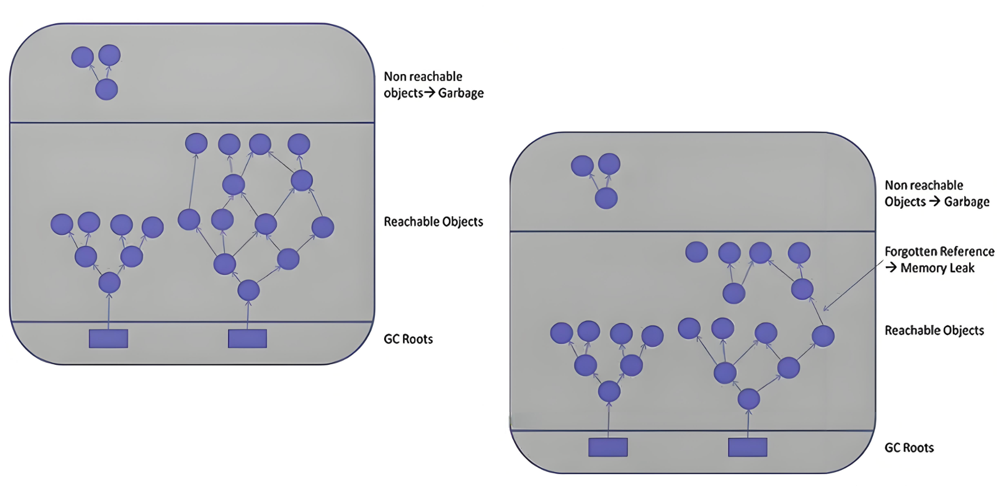
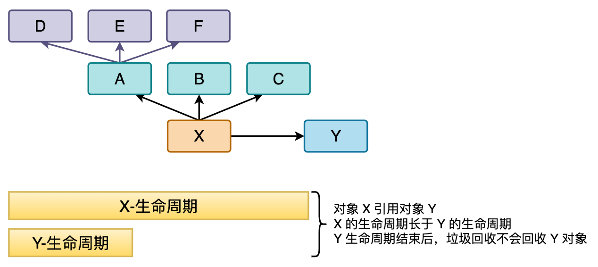

# 内存泄漏和内存溢出

## **内存泄漏（memory leak）**

[可达性分析算法](https://blog.csdn.net/chengqiuming/article/details/118973746)来判断对象是否是不再使用的对象，本质都是判断一个对象是否还被引用。那么这种情况下，由于代码的实现不同就会出现很多种内存泄漏问题：让JVM误以为此对象还在引用中，无法回收，造成内存泄漏。

<figure><figcaption><p>memory leak</p></figcaption></figure>

**严格来说，只有对象不会再被程序用到了，但是GC又不能回收他们的情况，才叫内存泄漏。**但实际情况中，很多时候一些不太好的实践（或疏忽）会导致对象的生命周期变得很长甚至导致OOM，也可以叫做宽泛意义上的“内存泄漏”。

如下图，当 Y 生命周期结束的时候，X 依然引用着 Y，这时候，垃圾回收期是不会回收对象 Y 的；如果对象 X 还引用着生命周期比较短的 A、B、C，对象 A 又引用着对象 D、E、F，这样就可能造成大量无用的对象不能被回收，进而占据了内存资源，造成内存泄漏，直到内存溢出。

<figure><figcaption></figcaption></figure>

申请了内存用完了不释放，比如一共有1024M的内存，分配了512M的内存一直不回收，那么可以用的内存只有512M了，仿佛泄露掉了一部分。

#### **内存泄漏的分类**

1. 经常发生：发生内存泄露的代码会被多次执行，每次执行，泄露一块内存；
2. 偶然发生：在某些特定情况下才会发生
3. 一次性：发生内存泄露的方法只会执行一次；
4. 隐式泄漏：一直占着内存不释放，直到执行结束；严格的说这个不算内存泄漏，因为最终释放掉了，但是如果执行时间特别长，也可能会导致内存耗尽。

## **内存溢出（out of memory）**

申请内存时，没有足够的内存可以使用；可见，内存泄漏和内存溢出的关系：**内存泄漏的增多，最终会导致内存溢出。**

## Java中内存泄露的8种情况 <a href="#java-e4-b8-a-d-e5-86-85-e5-ad-98-e6-b3-84-e9-9c-b2-e7-9a-848-e7-a7-8d-e6-83-85-e5-86-b5" id="java-e4-b8-a-d-e5-86-85-e5-ad-98-e6-b3-84-e9-9c-b2-e7-9a-848-e7-a7-8d-e6-83-85-e5-86-b5"></a>

#### **1. 静态集合类**

静态集合类，如HashMap、LinkedList等等。如果这些容器被定义为静态的，那么它们的生命周期与JVM程序一致，则容器中的对象在程序结束之前将不能被释放，从而造成内存泄漏。简单而言，长生命周期的对象持有短生命周期对象的引用，尽管短生命周期的对象不再使用，但是因为长生命周期对象持有它的引用而导致不能被回收。&#x20;

```java
public class MemoryLeak {
    static List list = new ArrayList();
    public void oomTests(){
        Object obj＝new Object(); //局部变量
        list.add(obj);
    }
}
```

#### **2. 单例模式**

单例模式，和静态集合导致内存泄露的原因类似，因为单例的静态特性，它的生命周期和 JVM 的生命周期一样长，所以如果单例对象持有外部对象的引用，那么这个外部对象也不会被回收，那么就会造成内存泄漏。

#### **3. 内部类持有外部类**

内部类持有外部类，如果一个外部类的实例对象的方法返回了一个内部类的实例对象。这个内部类对象被长期引用了，即使那个外部类实例对象不再被使用，但由于内部类持有外部类的实例对象，这个外部类对象将不会被垃圾回收，这也会造成内存泄漏。

#### **4. 各种连接，如数据库连接、网络连接和IO连接等**

在对数据库进行操作的过程中，首先需要建立与数据库的连接，当不再使用时，需要调用 `close()` 方法来释放与数据库的连接。只有连接被关闭后，垃圾回收器才会回收对应的对象。否则，如果在访问数据库的过程中，对 `Connection`、`Statement` 或 `ResultSet` 不显式地关闭，将会造成大量的对象无法被回收，从而引起内存泄漏。

```java
public static void main(String[] args) {
    try {
        Connection conn =null;
        Class.forName("com.mysql.jdbc.Driver");
        conn =DriverManager.getConnection("url","","");
        Statement stmt =conn.createStatement();
        ResultSet rs =stmt.executeQuery("....");
    } catch（Exception e）{//异常日志
    } finally {
        // 1．关闭结果集 Statement
        // 2．关闭声明的对象 ResultSet
        // 3．关闭连接 Connection
    }
}
```

#### **5. 不合理的变量作用域**

一般而言，一个变量的定义的作用范围大于其使用范围，很有可能会造成内存泄漏。另一方面，如果没有及时地把对象设置为null，很有可能导致内存泄漏的发生。

```java
public class UsingRandom {
    private String msg;
    public void receiveMsg(){
        readFromNet();//从网络中接受数据保存到msg中
        saveDB();//把msg保存到数据库中
    }
}
```

如上面这个伪代码，通过 `readFromNet()` 方法把接受的消息保存在变量 `msg` 中，然后调用 `saveDB()` 方法把 `msg` 的内容保存到数据库中，此时 `msg` 已经就没用了，由于 `msg` 的生命周期与对象的生命周期相同，此时 `msg` 还不能回收，因此造成了内存泄漏。实际上这个 `msg` 变量可以放在`receiveMsg()` 方法内部，当方法使用完，那么 `msg` 的生命周期也就结束，此时就可以回收了。还有一种方法，在使用完 `msg` 后，把 `msg` 设置为 `null`，这样垃圾回收器也会回收 `msg` 的内存空间。

#### **6. 改变哈希值**

当一个对象被存储进 HashSet 集合中以后，就不能修改这个对象中的那些参与计算哈希值的字段了。

否则，对象修改后的哈希值与最初存储进 HashSet 集合中时的哈希值就不同了，在这种情况下，即使在 contains 方法使用该对象的当前引用作为的参数去 HashSet 集合中检索对象，也将返回找不到对象的结果，这也会导致无法从 HashSet 集合中单独删除当前对象，造成内存泄漏。

这也是 `String` 为什么被设置成了不可变类型的原因，我们可以放心地把 String 存入 HashSet，或者把String 当做 HashMap 的 key 值；当我们想把自己定义的类保存到散列表的时候，需要保证对象的 hashCode 不可变。

```java
public class ChangeHashCode {
    public static void main(String[] args) {
        HashSet set = new HashSet();
        Person p1 = new Person(1001, "AA");
        Person p2 = new Person(1002, "BB");

        set.add(p1);
        set.add(p2);

        p1.name = "CC"; //导致了内存的泄漏
        set.remove(p1); //删除失败

        System.out.println(set);

        set.add(new Person(1001, "CC"));
        System.out.println(set);

        set.add(new Person(1001, "AA"));
        System.out.println(set);

    }
}

class Person {
    int id;
    String name;

    public Person(int id, String name) {
        this.id = id;
        this.name = name;
    }

    @Override
    public boolean equals(Object o) {
        if (this == o) return true;
        if (!(o instanceof Person)) return false;

        Person person = (Person) o;

        if (id != person.id) return false;
        return name != null ? name.equals(person.name) : person.name == null;
    }

    @Override
    public int hashCode() {
        int result = id;
        result = 31 * result + (name != null ? name.hashCode() : 0);
        return result;
    }

    @Override
    public String toString() {
        return "Person{" +
                "id=" + id +
                ", name='" + name + '\'' +
                '}';
    }
}
```

```java
/**
 * 例2
 */
public class ChangeHashCode1 {
    public static void main(String[] args) {
        HashSet<Point> hs = new HashSet<Point>();
        Point cc = new Point();
        cc.setX(10); //hashCode=41
        hs.add(cc);

        cc.setX(20); //hashCode=51，此行为导致了内存的泄漏

        System.out.println("hs.remove = " + hs.remove(cc)); //false
        hs.add(cc);
        System.out.println("hs.size = " + hs.size()); //size=2

        System.out.println(hs);
    }

}

class Point {
    int x;

    public int getX() {
        return x;
    }

    public void setX(int x) {
        this.x = x;
    }

    @Override
    public int hashCode() {
        final int prime = 31;
        int result = 1;
        result = prime * result + x;
        return result;
    }

    @Override
    public boolean equals(Object obj) {
        if (this == obj) return true;
        if (obj == null) return false;
        if (getClass() != obj.getClass()) return false;
        Point other = (Point) obj;
        if (x != other.x) return false;
        return true;
    }

    @Override
    public String toString() {
        return "Point{" +
                "x=" + x +
                '}';
    }
}
```

#### **7. 缓存泄露**

内存泄漏的另一个常见来源是缓存，一旦你把对象引用放入到缓存中，它就很容易被遗忘。比如：之前项目在一次上线的时候，应用启动奇慢直到夯死，就是因为代码中会加载一个表中的数据到缓存（内存）中，测试环境只有几百条数据，但是生产环境有几百万的数据。

对于这个问题，可以使用 `WeakHashMap` 代表缓存，这种 Map 的特点是，如果除了自身有对 key 的引用外，此 key 没有其他引用，那么此 `WeakHashMap` 会自动丢弃这个 key 。

```java
public class MapTest {
    static Map wMap = new WeakHashMap();
    static Map map = new HashMap();

    public static void main(String[] args) {
        init();
        testWeakHashMap();
        testHashMap();
    }

    public static void init() {
        String ref1 = "obejct1";
        String ref2 = "obejct2";
        String ref3 = "obejct3";
        String ref4 = "obejct4";
        wMap.put(ref1, "cacheObject1");
        wMap.put(ref2, "cacheObject2");
        map.put(ref3, "cacheObject3");
        map.put(ref4, "cacheObject4");
        System.out.println("String 引用 ref1，ref2，ref3，ref4");
    }

    public static void testWeakHashMap() {
        System.out.println("====== WeakHashMap GC 之前 ======");
        for (Object o : wMap.entrySet()) {
            System.out.println(o);
        }
        try {
            System.gc();
            TimeUnit.SECONDS.sleep(5);
        } catch (InterruptedException e) {
            e.printStackTrace();
        }
        System.out.println("====== WeakHashMap GC之后 ======");
        for (Object o : wMap.entrySet()) {
            System.out.println(o);
        }
    }

    public static void testHashMap() {
        System.out.println("====== HashMap GC 之前 ======");
        for (Object o : map.entrySet()) {
            System.out.println(o);
        }
        try {
            System.gc();
            TimeUnit.SECONDS.sleep(5);
        } catch (InterruptedException e) {
            e.printStackTrace();
        }
        System.out.println("====== HashMap GC 之后 ======");
        for (Object o : map.entrySet()) {
            System.out.println(o);
        }
    }
}
```

上面代码演示 WeakHashMap 如何自动释放缓存对象，当init函数执行完成后，局部变量字符串引用 `ref1`，`ref2`，`ref3`，`ref4` 都会消失，此时只有静态 map 中保存中对字符串对象的引用，可以看到，调用 `System.gc()` 之后，`HashMap` 中的引用没有被回收，而 `WeakHashMap` 里面的缓存被回收了。

#### **8. 监听器和其他回调**

内存泄漏第三个常见来源是监听器和其他回调，如果客户端在你实现的 API 中注册回调，却没有显示的取消，那么就会积聚。需要确保回调立即被当作垃圾回收的最佳方法是只保存它的弱引用，例如将他们保存成为 WeakHashMap 中的键。
