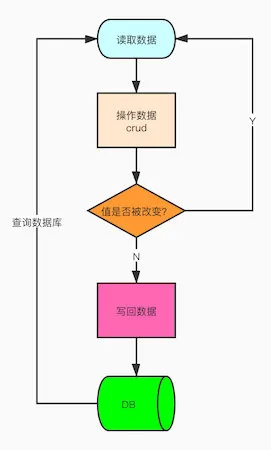
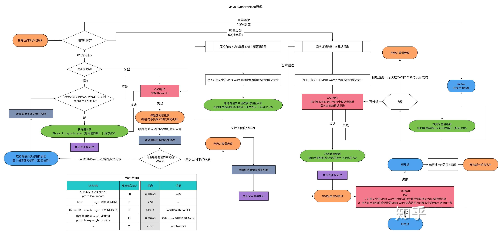

# 【线程安全】乐观锁和悲观锁

## 前言

关于线程安全一提到可能就是加锁，那锁本身是怎么去实现的呢？又有哪些加锁的方式呢？

今天就简单聊一下乐观锁和悲观锁，他们对应的实现 CAS ，Synchronized，ReentrantLock。

## 乐观锁

### CAS

CAS（Compare And Swap 比较并且替换）是**乐观锁**的一种实现方式，是一种轻量级锁，JUC 中很多工具类的实现就是基于 CAS 的。

#### CAS 怎么实现线程安全？

线程在读取数据时不进行加锁，在准备写回数据时，先去查询原值，操作的时候比较原值是否修改，若未被其他线程修改则写回，若已被修改，则重新执行读取流程。

举个栗子：现在一个线程要修改数据库的name，修改前我会先去数据库查name的值，发现name=`“帅丙”`，拿到值了，我们准备修改成name=`“三歪”`，在修改之前我们判断一下，原来的name是不是等于“**帅丙**”，如果被其他线程修改就会发现name不等于`“帅丙”`，我们就不进行操作，如果原来的值还是帅丙，我们就把name修改为`“三歪”`，至此，一个流程就结束了。

有点懵？理一下停下来理一下思路。

Tip：比较+更新 整体是一个**原子操作**，当然这个流程还是有问题的，我下面会提到。

他是乐观锁的一种实现，就是说认为数据总是不会被更改，我是乐观的仔，每次我都觉得你不会渣我，差不多是这个意思。

<figure><figcaption><p>CAS 示例</p></figcaption></figure>

#### CAS 存在什么问题？

你们看图发现没，要是结果一直变就一直循环了，CPU开销是个问题，还有ABA问题和只能保证一个共享变量原子操作的问题。

**ABA问题**

画图解释一下：

<figure><figcaption><p>ABA问题</p></figcaption></figure>

看到问题所在没，我说一下顺序：

1. 线程1读取了数据A
2. 线程2读取了数据A
3. 线程2通过CAS比较，发现值是A没错，可以把数据A改成数据B
4. 线程3读取了数据B
5. 线程3通过CAS比较，发现数据是B没错，可以把数据B改成了数据A
6. 线程1通过CAS比较，发现数据还是A没变，就写成了自己要改的值

在这个过程中任何线程都没做错什么，但是值被改变了，线程1却没有办法发现，其实这样的情况出现对结果本身是没有什么影响的，但是我们还是要防范，怎么防范我下面会提到。

**循环时间长开销大的问题**

是因为CAS操作长时间不成功的话，会导致一直自旋，相当于死循环了，CPU的压力会很大。

**只能保证一个共享变量的原子操作**

CAS操作单个共享变量的时候可以保证原子的操作，多个变量就不行了，JDK 5之后 `AtomicReference` 可以用来保证对象之间的原子性，就可以把多个对象放入CAS中操作。

#### CAS应用：JUC包下的原子类

那我就拿 `AtomicInteger` 举例，他的自增函数 `incrementAndGet()` 就是这样实现的，其中就有大量循环判断的过程，直到符合条件才成功。

<figure><figcaption></figcaption></figure>

大概意思就是循环判断给定偏移量是否等于内存中的偏移量，直到成功才退出，看到do while的循环没。

#### 乐观锁在项目开发中的实践

有的，就比如我们在很多订单表，流水表，为了防止并发问题，就会加入CAS的校验过程，保证了线程的安全，但是看场景使用，并不是适用所有场景，他的优点缺点都很明显。

**那开发过程中ABA你们是怎么保证的？**

**加标志位**，例如搞个自增的字段，操作一次就自增加一，或者搞个时间戳，比较时间戳的值。

举个栗子：现在我们去要求操作数据库，根据CAS的原则我们本来只需要查询原本的值就好了，现在我们一同查出他的标志位版本字段vision。

之前不能防止ABA的正常修改：

```
update table set value = newValue where value = #{oldValue}
//oldValue就是我们执行前查询出来的值 
```

带版本号能防止ABA的修改：

```
update table set value = newValue ，vision = vision + 1 where value = #{oldValue} and vision = #{vision} 
//判断原来的值和版本号是否匹配，中间有别的线程修改，值可能相等，但是版本号100%不一样
```

## 悲观锁

### synchronized

synchronized 是最常用的线程同步手段之一，上面提到的CAS是乐观锁的实现，synchronized 就是悲观锁了。

#### synchronized 如何保证同一时刻只有一个线程可以进入临界区？

synchronized，代表这个方法加锁，相当于不管哪一个线程（例如线程A），运行到这个方法时，都要检查有没有其它线程B（或者C、 D等）正在用这个方法（或者该类的其他同步方法），有的话要等正在使用synchronized 方法的线程B（或者C 、D）运行完这个方法后再运行此线程A，没有的话，锁定调用者，然后直接运行。

下面分别从 synchronized 对对象、方法和代码块三方面加锁，去介绍他怎么保证线程安全的。

#### synchronized 应用在对象上

在 JVM 中，对象在内存中分为三块区域：**对象头**（Header）、实例数据（Instance\
Data）和**对齐填充**（Padding）。

**对象头**：

我们以Hotspot虚拟机为例，Hotspot的对象头主要包括两部分数据：Mark Word（标记字段）、Klass Pointer（类型指针）。

你可以看到在对象头中保存了**锁标志位**和**指向 monitor 对象的起始地址**，如下图所示，右侧就是对象对应的 Monitor 对象。

<figure><figcaption><p>对象头</p></figcaption></figure>

**当 Monitor 被某个线程持有后，就会处于锁定状态，如图中的 Owner 部分，会指向持有 Monitor 对象的线程。**

另外 Monitor 中还有两个队列分别是 `EntryList` 和 `WaitList` ，主要是用来存放进入及等待获取锁的线程。

如果线程进入，则得到当前对象锁，那么别的线程在该类所有对象上的任何操作都不能进行。

**Mark Word**：默认存储对象的HashCode，分代年龄和锁标志位信息。它会根据对象的状态复用自己的存储空间，也就是说在运行期间Mark Word里存储的数据会随着锁标志位的变化而变化。

**Klass Point**：对象指向它的类元数据的指针，虚拟机通过这个指针来确定这个对象是哪个类的实例。

> 在对象级使用锁通常是一种比较粗糙的方法，为什么要将整个对象都上锁，而不允许其他线程短暂地使用对象中其他同步方法来访问共享资源？

如果一个对象拥有多个资源，就不需要只为了让一个线程使用其中一部分资源，就将所有线程都锁在外面。

由于每个对象都有锁，可以如下所示使用虚拟对象来上锁：

```java
class FineGrainLock {
  　MyMemberClass x, y;
  　Object xlock = new Object(), ylock = new Object();
  　public void foo(){
  　    synchronized(xlock) { //access x here
  　    }
  　    //do something here - but don't use shared resources
  　    synchronized(ylock) { //access y here
  　    }
  　}
    public void bar(){
  　    synchronized(this){ //access both x and y here
      　}
     　 // do something here - but don't use shared resources
    }
}
```

#### synchronized 应用在方法上

synchronized 应用在方法上时，在字节码中是通过方法的 ACC\_SYNCHRONIZED 标志来实现的。

我反编译了一小段代码，我们可以看一下我加锁了一个方法，在字节码长啥样，**flags** 字段瞩目：

```java
synchronized void test();
  descriptor: ()V
  flags: ACC_SYNCHRONIZED
  Code:
    stack=0, locals=1, args_size=1
       0: return
    LineNumberTable:
      line 7: 0
    LocalVariableTable:
      Start  Length  Slot  Name   Signature
          0       1     0  this   Ljvm/ClassCompile;
```

反正其他线程进这个方法就看看是否有这个标志位，有就代表有别的仔拥有了他，你就别碰了。

#### synchronized 应用在同步块上

synchronized 应用在同步块上时，在字节码中是通过 monitorenter 和 monitorexit 实现的。

每个对象都会与一个 monitor 相关联，当某个 monitor 被拥有之后就会被锁住，当线程执行到monitorenter 指令时，就会去尝试获得对应的 monitor。

**步骤如下：**

1. 每个 monitor 维护着一个记录着拥有次数的计数器。未被拥有的 monitor 的该计数器为0，当一个线程获得 monitor（执行 monitorenter）后，该计数器自增变为 1 。
2.  当同一个线程再次获得该 monitor 的时候，计数器再次自增；

    当不同线程想要获得该 monitor 的时候，就会被阻塞。
3.  当同一个线程释放 monitor（执行 monitorexit 指令）的时候，计数器再自减。

    当计数器为0的时候，monitor 将被释放，其他线程便可以获得 monitor。

同样看一下反编译后的一段锁定代码块的结果：

```java
public void syncTask();
  descriptor: ()V
  flags: ACC_PUBLIC
  Code:
    stack=3, locals=3, args_size=1
       0: aload_0
       1: dup
       2: astore_1
       3: monitorenter  //注意此处，进入同步方法
       4: aload_0
       5: dup
       6: getfield      #2            // Field i:I
       9: iconst_1
      10: iadd
      11: putfield      #2            // Field i:I
      14: aload_1
      15: monitorexit   //注意此处，退出同步方法
      16: goto          24
      19: astore_2
      20: aload_1
      21: monitorexit   //注意此处，退出同步方法
      22: aload_2
      23: athrow
      24: return
    Exception table:
    //省略其他字节码.......
```

**小结：**

**同步方法和同步代码**块底层都是通过 monitor 来实现同步的。

两者的区别：同步方式是通过方法中的 access\_flags 中设置 ACC\_SYNCHRONIZED 标志来实现，同步代码块是通过 monitorenter 和 monitorexit 来实现。

我们知道了每个对象都与一个 monitor 相关联，而 monitor 可以被线程拥有或释放。

#### 以前我们一直说 synchronized 是重量级的锁，为什么现在都不提了？

在多线程并发编程中 synchronized 一直是元老级角色，很多人都会称呼它为重量级锁。

但是，随着 Java SE 1.6 对 synchronized 进行了各种优化之后，有些情况下它就并不那么重，Java SE 1.6 中为了减少获得锁和释放锁带来的性能消耗而引入了**偏向锁**和**轻量级锁**。

针对 synchronized 获取锁的方式，JVM 使用了**锁升级**的优化方式，就是**先使用偏向锁优先同一线程**然后再次获取锁，**如果失败，就升级为 CAS 轻量级锁**，如果失败就会短暂自旋，防止线程被系统挂起。最后如果**以上都失败就升级为重量级锁**。

**Tip**：本来锁升级的过程我是搞了个贼详细贼复杂的图，但是我发现不便于理解，我就幼儿园化了，所以就有了个简单版本的，先看下复杂版本的：

<figure><figcaption><p>锁升级过程</p></figcaption></figure>

幼儿园版本：

<figure><figcaption><p>简单版锁升级</p></figcaption></figure>

<figure><figcaption></figcaption></figure>

对了锁只能升级，不能降级。

**refers:**

[https://www.jianshu.com/p/0f75e95f9e1f](https://www.jianshu.com/p/0f75e95f9e1f)\
[https://zhuanlan.zhihu.com/p/289520280](https://zhuanlan.zhihu.com/p/289520280)

### ReentrantLock

在介绍 ReentrantLock 之前，我觉得我有必要先介绍AQS（AbstractQueuedSynchronizer）。

AQS：也就是队列同步器，这是实现 ReentrantLock 的基础。

AQS 有一个 state 标记位，值为 1 时表示有线程占用，其他线程需要进入到同步队列等待，同步队列是一个双向链表。

<figure><figcaption><p>AQS</p></figcaption></figure>

当获得锁的线程需要等待某个条件时，会进入 condition 的等待队列，等待队列可以有多个。

当 condition 条件满足时，线程会从等待队列重新进入同步队列进行获取锁的竞争。

ReentrantLock 就是基于 AQS 实现的，如下图所示，ReentrantLock 内部有公平锁和非公平锁两种实现，差别就在于新来的线程是否比已经在同步队列中的等待线程更早获得锁。

和 ReentrantLock 实现方式类似，Semaphore 也是基于 AQS 的，差别在于 ReentrantLock 是独占锁，Semaphore 是共享锁。

<figure><figcaption></figcaption></figure>

从图中可以看到，ReentrantLock里面有一个内部类 Sync，Sync 继承 AQS（AbstractQueuedSynchronizer），添加锁和释放锁的大部分操作实际上都是在 Sync 中实现的。

它有公平锁 FairSync 和非公平锁 NonFairSync 两个子类。

ReentrantLock默认使用非公平锁，也可以通过构造器来显示的指定使用公平锁。

## 技术总结

锁其实有很多，我这里只是简单的介绍了一下乐观锁和悲观锁，后面还会有，自旋锁，自适应自旋，公平锁，非公平锁，可重入（文中提到的都是可重入），不可重入锁，共享锁，排他锁等。

<figure><figcaption><p>技术总结</p></figcaption></figure>
