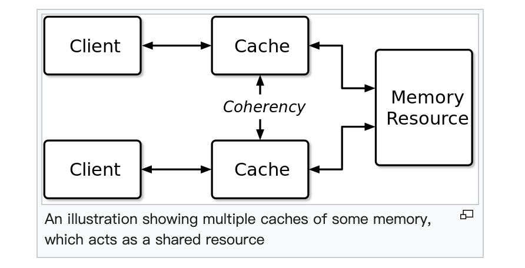
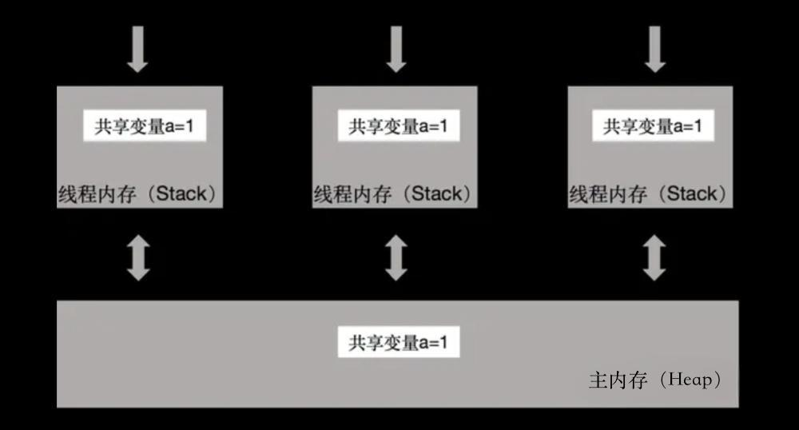
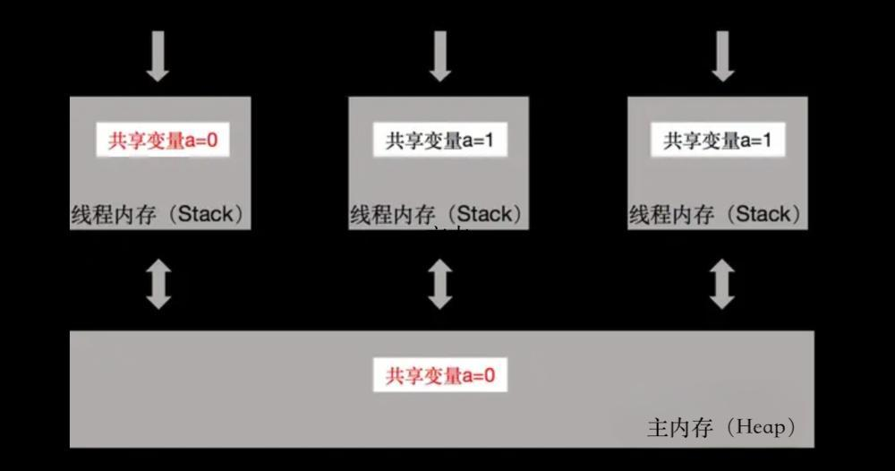
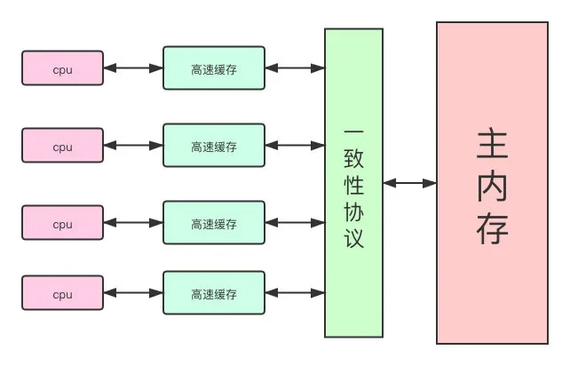
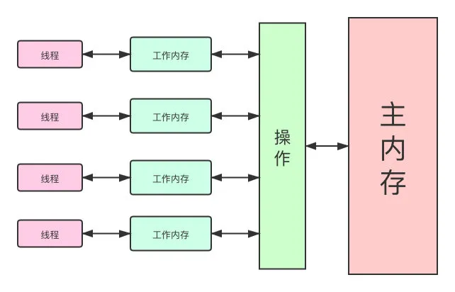
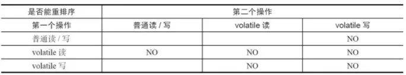
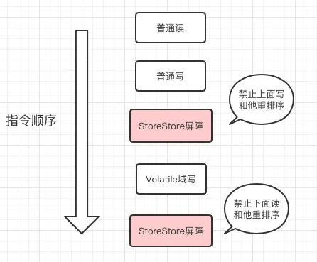
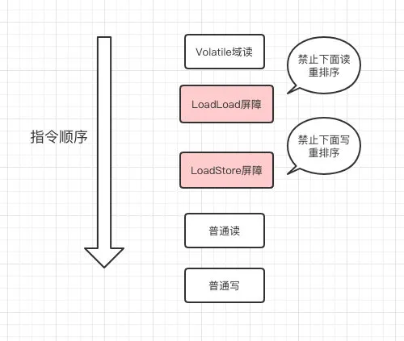

# volatile

## 快速了解

### 1. 从缓存一致性说起

关于缓存一致性，[维基百科的解释](https://en.wikipedia.org/wiki/Cache\_coherence)非常准确并且通俗，它是这样描述的：

> In computer architecture, cache coherence is the uniformity of shared resource data that ends up stored in multiple local caches. When clients in a system maintain caches of a common memory resource, problems may arise with incoherent data, which is particularly the case with CPUs in a multiprocessing system.\
> 在计算机体系结构中，缓存一致性是指最终存储在多个本地缓存中的共享数据的一致性。当多个客户端都维护同一个内存资源的缓存时，就可能出现数据不一致的问题。这种情况在多CPU并行系统中尤其常见。

紧接着，维基百科举了一个例子：

> 在下面的插图中，两个客户端都因为之前的读操作而保存了指定内存块的缓存副本。假设位于下面的客户端对内存块进行了改写操作，而上面的客户端可能因为没有收到任何改写操作的通知而依旧保存一个无效的缓存副本。缓存一致性致力于通过维护多个缓存中的数据值一致性视图来管理此类冲突。

<figure><figcaption><p>缓存一致性</p></figcaption></figure>

简单的描述缓存一致性问题：对于某个共享变量，每个操作单元都缓存一个该变量的副本。当一个操作单元更新其副本时，其他的操作单元可能没有及时发现，进而产生缓存一致性问题。

### 2. Java 中的缓存一致性

缓存一致性问题非常常见，在 Java 中也有这样的案例。假设有一个变量 `a=1`，它被3个线程所共享。Jvm在运行时，每个线程都会在自己的工作空间（高速缓存保存的副本，不是栈区）保存一份变量 `a` 的副本。如下图：

<figure><figcaption></figcaption></figure>

某个时刻，线程 t1 需要更新 `a=0`。与此同时，线程 t2 需要读 `a` 的值，线程 t3 需要读 `a` 的值。由于这三个“动作”是并发进行的，很可能出现下面的结果：线程 t2 和线程 t3 仍然读到 `a=1`。而我们希望的结果是，线程 t2 和线程 t3 读到 `a=0`。但是，线程 t2 和线程 t3 何时再次从主内存中读取变量 `a` 的值是不受控制的。可能很快，也可能很慢。

<figure><figcaption></figcaption></figure>

### **3. Java 内存模型（JMM）**

为了解决类似这样的问题，**Java 内存模型（JMM）**应运而生。它规定了必须要遵守哪些访问规则，以保证程序的正确性。下面是对Java内存模型的介绍：（选自[官方文档](https://docs.oracle.com/javase/specs/jls/se17/html/jls-17.html)）

> A _memory model_ describes, given a program and an execution trace of that program。The Java programming language memory model works by examining each read in an execution trace and checking that the write observed by that read is valid according to certain rules.\
> Java 内存模型描述了程序的执行过程。Java 内存模型是这样工作的：它检查执行过程中的每一个读操作，并且按照某些规则来核对被当前读操作感知到的写操作是否合法。

### 4. volatile 访问规则

在 JMM 众多的访问规则中，关于 `volatile` 有这样一条规则：（[引用自Happens-before Order](https://docs.oracle.com/javase/specs/jls/se17/html/jls-17.html#jls-17.1)）

> A write to a volatile field _happens-before_ every subsequent read of that field.&#x20;
>
> 对一个 volatile 变量的写操作 happens-before 对这个变量之后的每一个读操作。

happens-before 的含义如下：（[引用自Happens-before Order](https://docs.oracle.com/javase/specs/jls/se17/html/jls-17.html#jls-17.1)）

> If one action _happens-before_ another, then the first is visible to and ordered before the second. 如果指令甲 happens-before 指令乙，那么指令甲必须排序在指令乙之前，并且指令甲的执行结果对指令乙可见。

从规则的定义可知，如果多个线程同时操作 volatile 变量，那么对该变量的写操作必须在读操作之前执行(禁止重排序)，并且写操作的结果对读操作可见（强缓存一致性）。

正是由于 JMM 这样“明智”的限制，使得用 volatile 声明的变量总是能够在多线程中依旧保持其_可见性_。在之前的例子中，如果把变量 `a` 用 `volatile` 声明，那么当线程 t1 更新 `a=0` 时，与之并发执行的线程 t2 和线程 t3 读到的 `a` 的值就会是 0 了。

## 详细解释

### 1. 前言

分析如下 demo 代码：

```java
public class Test {
    public static void main(String[] args) {
        TestTread testTread = new TestTread();
        testTread.start();
        for (;;) {
            if (testTread.isFlag()) {
                System.out.println("nice");
            }
        }
    }
}

public class TestTread extends Thread {
    private boolean flag = false;
    
    public boolean isFlag() {
        return flag;
    }

    @Override
    public void run() {
        try {
            Thread.sleep(1000);
        } catch (InterruptedException e) {
            e.printStackTrace();
            Thread.currentThread().interrupt();
        }
        flag = true;
        System.out.println("flag=" + flag);
    }
}
```

你会发现，永远都不会输出 **“nice”** 这一段代码，按道理线程改了 `flag` 变量，主线程也能访问到的呀？

为会出现这个情况呢？那我们就需要聊一下另外一个东西了。

**JMM（JavaMemoryModel）：**

Java 内存模型，是 Java 虚拟机规范中所定义的一种内存模型，Java 内存模型是标准化的，屏蔽掉了底层不同计算机的区别。

#### 先科普一下现代计算机的内存模型

其实早期计算机中 CPU 和内存的速度是差不多的，但在现代计算机中，**CPU 的指令速度远超内存的存取速度**，由于计算机的存储设备与处理器的运算速度有几个数量级的差距，所以现代计算机系统都不得不加入一层读写速度尽可能接近处理器运算速度的**高速缓存（Cache）**来作为内存与处理器之间的缓冲。

将运算需要使用到的数据复制到缓存中，让运算能快速进行，当运算结束后再从缓存同步回内存之中，这样处理器就无须等待缓慢的内存读写了。

基于高速缓存的存储交互很好地解决了处理器与内存的速度矛盾，但是也为计算机系统带来更高的复杂度，因为它引入了一个新的问题：**缓存一致性（CacheCoherence）**。

在多处理器系统中，每个处理器都有自己的高速缓存，而它们又共享同一主内存（MainMemory）。

<figure><figcaption><p>现代计算机内存模型</p></figcaption></figure>

### 2. 然后我们可以聊一下 JMM 了

**Java 内存模型（Java Memory Model）**描述了 Java 程序中各种变量（线程共享变量）的访问规则，以及在JVM中**将变量存储到内存**和**从内存中读取变量**的底层细节。

#### JMM 有以下规定

所有的共享变量都存储于主内存，这里所说的变量指的是实例变量和类变量，不包含局部变量，因为局部变量是线程私有的，因此不存在竞争问题。

每一个线程还存在自己的工作内存，线程的工作内存，保留了被线程使用的变量的工作副本。

**线程对变量的所有的操作（读，取）都必须在工作内存中完成，而不能直接读写主内存中的变量**。

不同线程之间也不能直接访问对方工作内存中的变量，线程间变量的值的传递需要通过主内存中转来完成。

#### 本地内存和主内存的关系

<figure><figcaption><p>工作内存和主内存的关系</p></figcaption></figure>

正是因为这样的机制，才导致了**可见性问题**的存在，那我们就讨论下可见性的解决方案。

### 3. 可见性的解决方案 <a href="#blogtitle2" id="blogtitle2"></a>

#### 加锁

```java
public static void test1() {
    TestTread testTread = new TestTread();
    testTread.start();
    for (;;) {
        synchronized (testTread) {
            if (testTread.isFlag()) {
                System.out.println("nice");
            }
        }
    }
}
```

**为什么加锁可以解决可见性问题？**

因为某一个线程进入 `synchronized` 代码块前，线程会获得锁，清空工作内存，从主内存拷贝共享变量最新的值到工作内存成为副本，执行代码，将修改后的副本的值刷新回主内存中，线程释放锁。

而获取不到锁的线程会阻塞等待，所以变量的值肯定一直都是最新的。

#### &#x20;volatile 修饰共享变量

```java
public class TestTread extends Thread {
    private volatile boolean flag = false;

    public boolean isFlag() {
        return flag;
    }

    @Override
    public void run() {
        try {
            Thread.sleep(1000);
        } catch (InterruptedException e) {
            e.printStackTrace();
            Thread.currentThread().interrupt();
        }
        flag = true;
        System.out.println("flag=" + flag);
    }
}
```

开头的代码优化完之后应该是这样的：

```java
public class Test {
    public static void main(String[] args) {
        TestTread testTread = new TestTread();
        testTread.start();
        for (;;) {
            synchronized(testTread) {
                if (testTread.isFlag()) {
                    System.out.println("nice");
                }
            }
        }
    }
}

public class TestTread extends Thread {
    private volatile boolean flag = false;
    
    public boolean isFlag() {
        return flag;
    }

    @Override
    public void run() {
        try {
            Thread.sleep(1000);
        } catch (InterruptedException e) {
            e.printStackTrace();
            Thread.currentThread().interrupt();
        }
        flag = true;
        System.out.println("flag=" + flag);
    }
}
```

#### volatile 做了什么？

每个线程操作数据的时候会把数据从主内存读取到自己的工作内存，如果他操作了数据并且写回了，那么其它已经读取的线程的变量副本就会失效了，需要对数据进行操作就需要再次去主内存中读取。

**volatile 保证不同线程对共享变量操作的可见性**，也就是说一个线程修改了 volatile 修饰的变量，当修改写回主内存时，另外一个线程立即看到最新的值。

是不是看着加一个关键字很简单，但实际上他在背后含辛茹苦默默付出了不少，我从计算机层面的缓存一致性协议解释一下这些名词的意义。

之前我们说过当多个处理器的运算任务都涉及同一块主内存区域时，将可能导致各自的缓存数据不一致，比如变量在多个 CPU 之间的共享。

如果真的发生这种情况，那同步回到主内存时以谁的缓存数据为准呢？

为了解决一致性的问题，需要各个处理器访问缓存时都遵循一些协议，在读写时要根据协议来进行操作，这类协议有MSI、**MESI(Illinois Protocol)**、MOSI、Synapse、Firefly 及 DragonProtocol 等。

### 4. volatile 的 MESI（缓存一致性协议） <a href="#blogtitle3" id="blogtitle3"></a>

当 CPU 写数据时，如果发现操作的变量是共享变量，即在其他 CPU 中也存在该变量的副本，会发出信号通知其他 CPU 将该变量的缓存行置为无效状态，因此当其他 CPU 需要读取这个变量时，发现自己缓存中缓存该变量的缓存行是无效的，那么它就会从内存重新读取。

**怎么发现数据是否失效呢？**

#### 嗅探 <a href="#blogtitle4" id="blogtitle4"></a>

每个处理器通过嗅探在总线上传播的数据来检查自己缓存的值是不是过期了，当处理器发现自己缓存行对应的内存地址被修改，就会将当前处理器的缓存行设置成无效状态，当处理器对这个数据进行修改操作的时候，会重新从系统内存中把数据读到处理器缓存里。

#### 嗅探的缺点 - 总线风暴

由于 volatile 的 MESI 缓存一致性协议，需要不断从主内存嗅探和 cas 不断循环，无效交互会导致总线带宽达到峰值。

所以**不要大量使用 volatile**，至于什么时候使用 volatile 什么时候使用锁，需要根据场景区分。

### 5. volatile 禁止指令重排序

#### 什么是重排序？

为了提高性能，编译器和处理器常常会对既定的代码执行顺序进行指令重排序。

#### **重排序的类型**

<figure><figcaption><p>源码到最终执行经过的重排序</p></figcaption></figure>

一个好的内存模型实际上会放松对处理器和编译器规则的束缚，也就是说软件技术和硬件技术都为同一个目标而奋斗：**在不改变程序执行结果的前提下，尽可能提高执行效率。**

JMM 对底层尽量减少约束，使其能够发挥自身优势。

因此，**在执行程序时，为了提高性能，编译器和处理器常常会对指令进行重排序。**

一般重排序可以分为如下三种：

* **编译器优化的重排序：**编译器在不改变单线程程序语义的前提下，可以重新安排语句的执行顺序;
* **指令级并行的重排序：**现代处理器采用了指令级并行技术来将多条指令重叠执行。如果不存在数据依赖性，处理器可以改变语句对应机器指令的执行顺序;
* **内存系统的重排序：**由于处理器使用缓存和读/写缓冲区，这使得加载和存储操作看上去可能是在乱序执行的。

这里还得提一个概念，`as-if-serial`。

#### as-if-serial

不管怎么重排序，单线程下的执行结果不能被改变。

编译器、runtime 和处理器都必须遵守 as-if-serial 语义。

#### volatile 怎么保证不被执行重排序 - **内存屏障**

&#x20;Java 编译器会在生成指令系列时在适当的位置插入**内存屏障**指令来禁止特定类型的处理器重排序。

为了实现 volatile 的内存语义，JMM 会限制特定类型的编译器和处理器重排序，JMM 针对编译器制定了 volatile 重排序规则表：

<figure><figcaption><p>volatile 重排序规则表</p></figcaption></figure>

需要注意的是：volatile 写操作是在前面和后面**分别插入内存屏障**，而 volatile 读操作是在**后面插入两个内存屏障**。

**volatile 写操作：**

<figure><figcaption><p>volatile 写内存屏障</p></figcaption></figure>

**volatile 读操作：**

<figure><figcaption><p>volatile 读内存屏障</p></figcaption></figure>

上面的我提过重排序原则，为了提高处理速度，JVM会对代码进行编译优化，也就是指令重排序优化，**并发编程下指令重排序会带来一些安全隐患**：如指令重排序导致的多个线程操作之间的不可见性。

如果让程序员再去了解这些底层的实现以及具体规则，那么程序员的负担就太重了，严重影响了并发编程的效率。

从JDK5开始，提出了 **happens-before** 的概念，通过这个概念来阐述操作之间的内存可见性。

### 6. volatile 的 happens-before 访问规则

如果一个操作执行的结果需要对另一个操作可见，那么这两个操作之间必须存在 happens-before 关系。

**volatile域规则：对一个volatile域的写操作，happens-before 于任意线程后续对这个volatile域的读。**

如果现在我的 `flag` 变成了 `false`，那么后面的那个操作，一定要知道我变了。

### 7. volatile 无法保证原子性

聊了这么多，我们要知道 volatile 是没办法保证原子性的，一定要保证原子性，可以使用其他方法。

原子性就是一次操作，要么完全成功，要么完全失败。

假设现在有 N 个线程对同一个 volatile 变量进行累加也是没办法保证结果是对的，因为读写这个过程并不是原子性的。

要解决也简单，**要么用原子类（比如 AtomicInteger），要么加锁**。

## 应用

单例有8种写法，我说一下里面比较特殊的一种，涉及 volatile 的：

```java
public class Singleton {
    // 保证可见性和禁止指令重排序
    private volatile static Singleton instance = null;

    private Singleton() {}

    public static Singleton getInstance() {
        // 第一重检查锁定
        if (instance == null) {
            // 同步锁定代码块
            synchronized (Singleton.class) {
                // 第二重检查锁定
                if (instance == null) {
                    // 注意：非原子操作
                    instance = new Singleton();
                }
            }
        }
        return instance;
    }
}
```

#### 为什么要双重检查？如果不用 volatile 会怎么样？

我先讲一下**禁止指令重排序**的好处。

实际上创建对象要进过如下几个步骤：

1. 分配内存空间。
2. 调用构造器，初始化实例。
3. 返回地址给引用。

前面已经讲过，这是可能发生指令重排序的，有可能构造函数在对象初始化完成前就赋值完成了，在内存里面开辟了一片存储区域后直接返回内存的引用，这个时候还没真正的初始化完对象。

但是别的线程去判断 `instance != null`，直接拿去用了，其实这个对象是个半成品，那就有空指针异常了。

#### 怎么保证可见性？

（这里讲的应该是 synchronized 的作用？）因为可见性，线程 A 在自己的内存初始化了对象，还没来得及写回主内存，B线程也这么做了，那就创建了多个对象，不是真正意义上的单例了。

## volatile 与 synchronized 的区别

volatile 只能修饰实例变量和类变量，而 synchronized 可以修饰方法，以及代码块。

volatile 保证数据的可见性，但是不保证原子性（多线程进行写操作，不保证线程安全）；而synchronized 是一种排他（互斥）的机制。

volatile 用于禁止指令重排序：可以解决单例双重检查对象初始化代码执行乱序问题。

volatile 可以看做是轻量版的 synchronized，volatile 不保证原子性，但是如果是对一个共享变量进行多个线程的赋值，而没有其他的操作，那么就可以用 volatile 来代替 synchronized，因为赋值本身是有原子性的，而 volatile 又保证了可见性，所以就可以保证线程安全了。

## 总结

1. volatile 修饰符适用于以下场景：某个属性被多个线程共享，其中有一个线程修改了此属性，其他线程可以立即得到修改后的值，比如 boolean flag；或者作为触发器，实现轻量级同步。
2. volatile 属性的读写操作都是无锁的，它不能替代 synchronized，因为它没有提供原子性和互斥性。因为无锁，不需要花费时间在获取锁和释放锁上，所以说它是低成本的。
3. volatile 只能作用于属性，我们用 volatile 修饰属性，这样 compilers 就不会对这个属性做指令重排序。
4. volatile 提供了可见性，任何一个线程对其的修改将立马对其他线程可见，volatile 属性不会被线程缓存，始终从主存中读取。
5. volatile 提供了 happens-before 保证，对 volatile 变量 v 的写入 happens-before 所有其他线程后续对 v 的读操作。
6. volatile 可以使得 long 和 double 的赋值是原子的。
7. volatile 可以在单例双重检查中实现可见性和禁止指令重排序，从而保证安全性。


**refer to:**

* [对volatile的理解！](https://www.zhihu.com/tardis/bd/art/56540493?source\_id=1001)
* [https://www.cnblogs.com/cxy2020/p/12951333.html](https://www.cnblogs.com/cxy2020/p/12951333.html)
